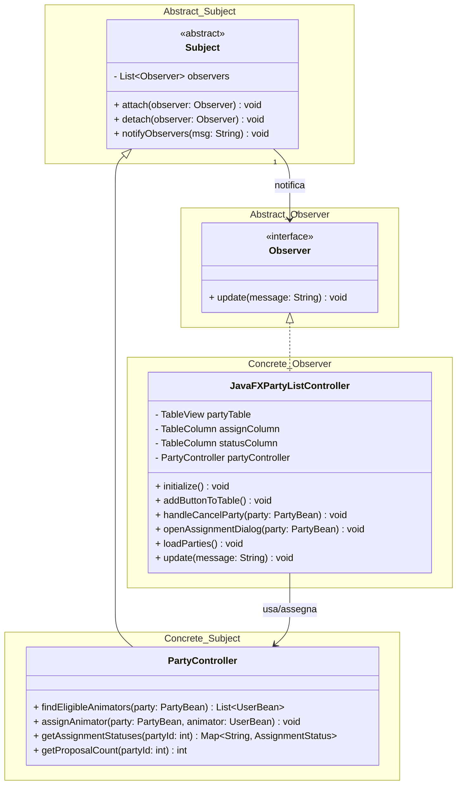

# Design-Level Diagram - Observer Pattern (Assign work to animator)

Questo diagramma rappresenta l'implementazione del **GoF Observer Pattern** calato rigorosamente nello Use Case specificato, eliminando gli strati non necessari.

